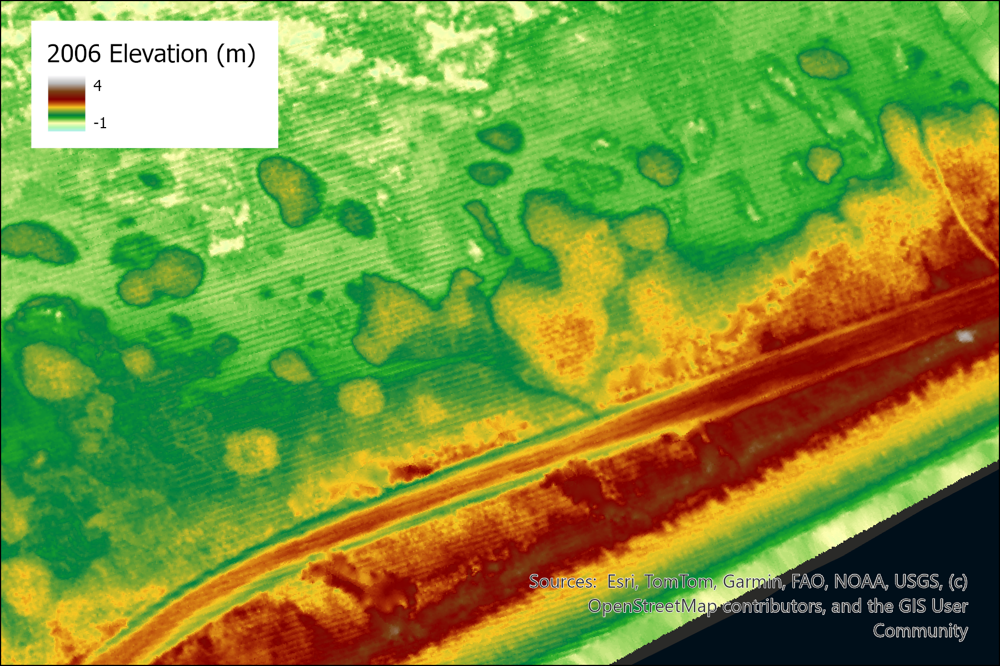
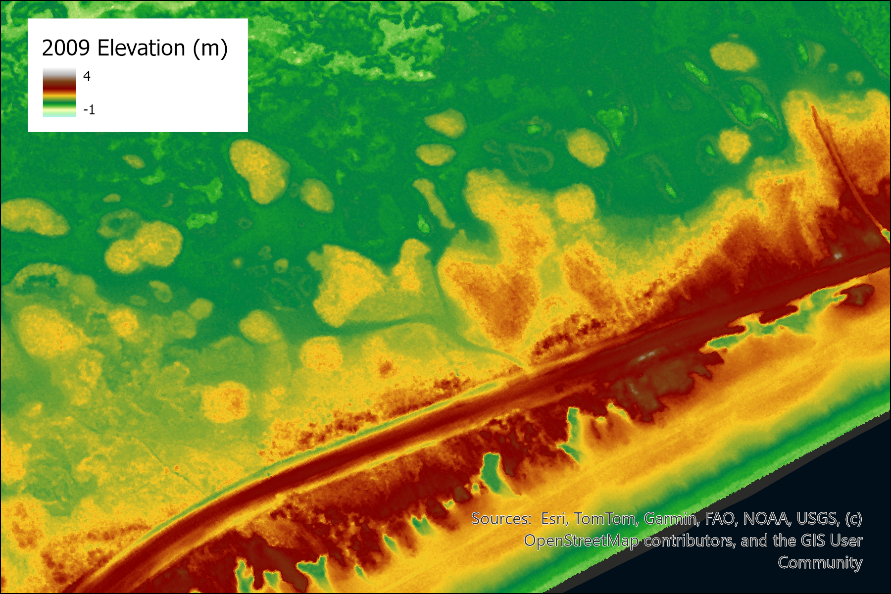
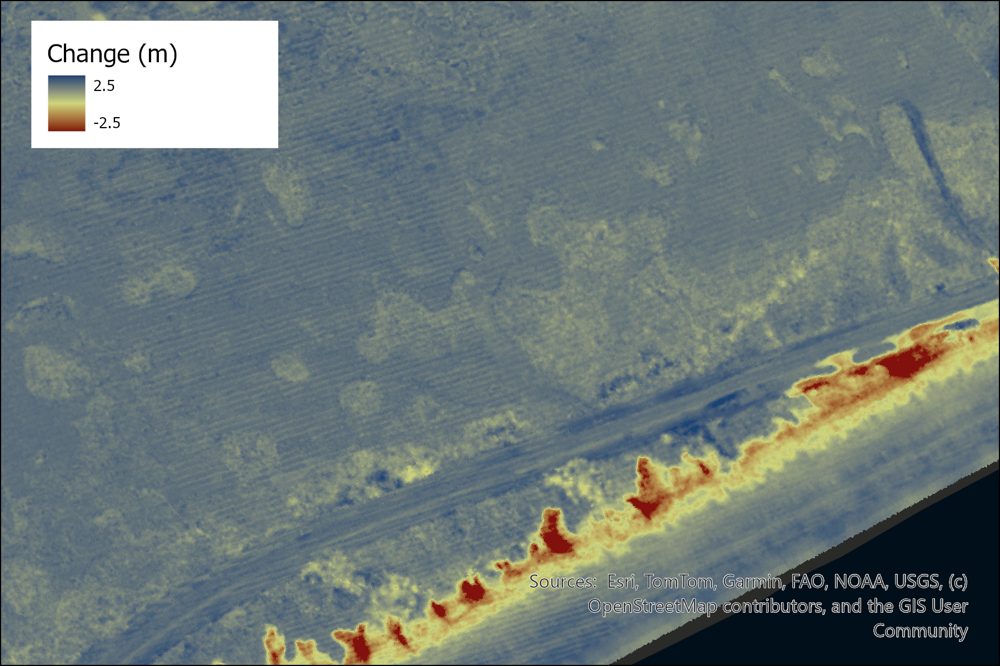
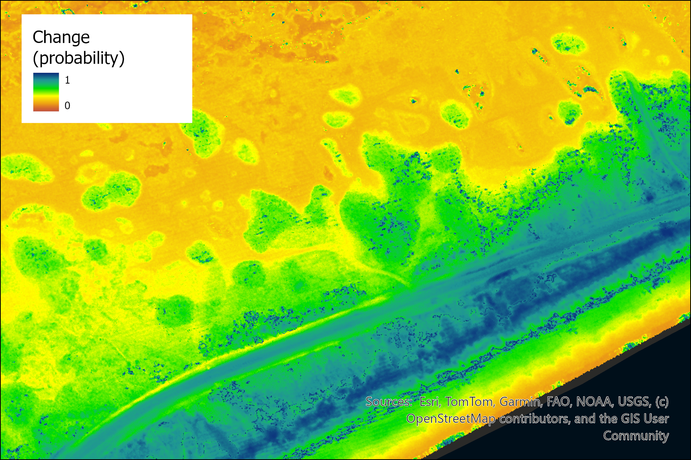

# DEM change probability in context of spatially variable uncertainty

**Citation:** pwernette. (2026). pwernette/DEM_differencing_with_uncertainty: DEM Change with Uncertainty (1.01). Zenodo. 

This repository contains implementations for analyzing DEM change accounting for spatially variable uncertainty. The work is the focus of the following paper:

> Wernette, P., J. Lehner, and C. Houser. (2020) What change is 'real'? A probabilistic approach to accounting for uncertainty in environmental change analysis. *Geomorphology*, 355, 107083. http://doi.org/10.1016/j.geomorph.2020.107083.

The following maps illuestrate the DEM at time t (left) and time t+1 (right):

  

    
  

  

    
  

Using this program, we can compute the magnitude of change (left) and the probability of change (right) at each pixel:

  

    
  

  

    
  

## Overview

This project provides a probabilistic approach to detecting "real" changes in digital elevation models (DEMs) by accounting for spatially variable uncertainty. Two implementations are available:

- **[program_c](./program_c/README.md)** — C++ implementation offering high performance for large-scale analyses
- **[program_python](./program_python/README.md)** — Python implementation offering flexibility and ease of use
- **[qgis_plugin](./qgis_plugin/README.md)** — QGIS plugin for visualizing and analyzing DEM change

Although the described approach was initially used to describe changes in landscape elevation, it is adaptable to a wide range of spatially-contingent phenomena.

## Getting Started

Select an implementation based on your needs:

- **Use C++** if you need maximum performance and have pre-compiled binaries available
- **Use Python** for more accessible development and experimentation
- **Use QGIS** for visualization and analysis of DEM change in QGIS software

Each implementation has its own README with installation and usage instructions.

## About

The project is part of a broader collaboration to better understand landscape change and morphodynamic processes.

For questions related to this project, please contact:

Phillipe Wernette, PhD [pwernett@msu.edu]()
